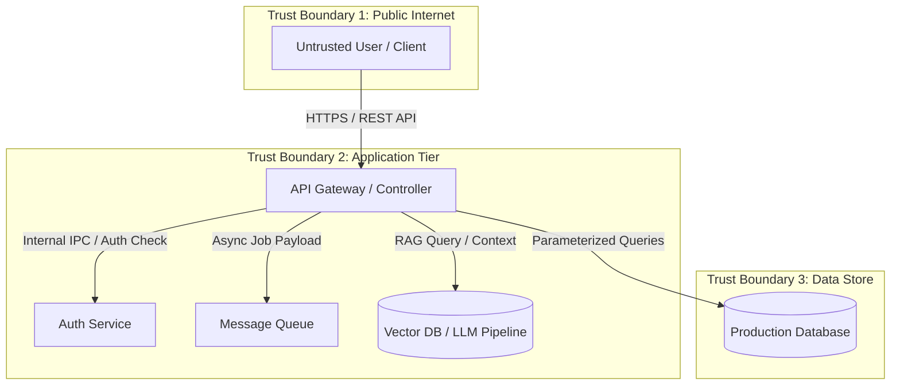
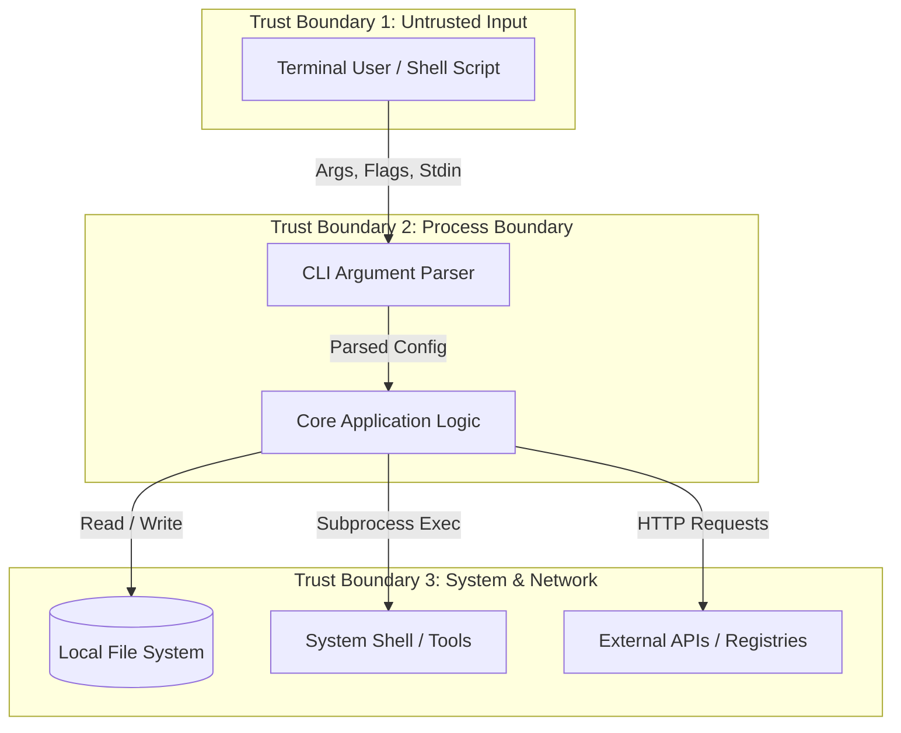
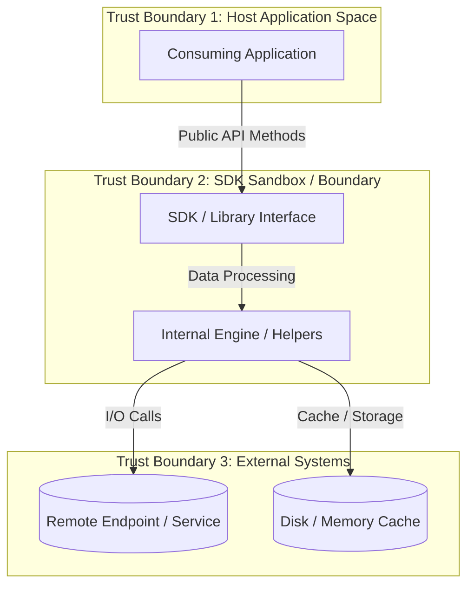
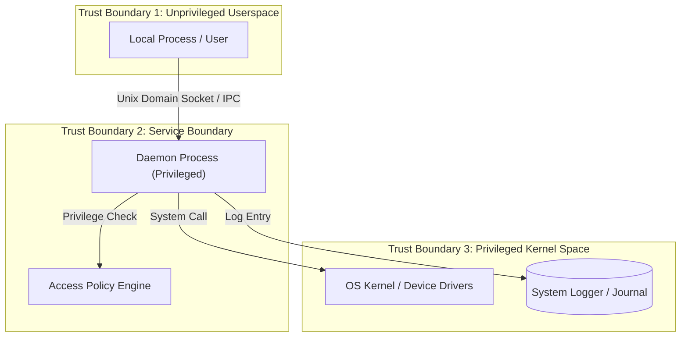
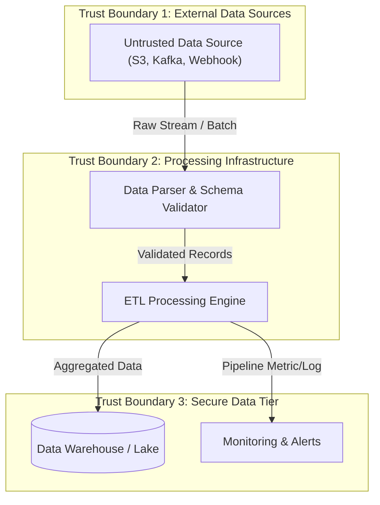

# Threat Model (STRIDE Methodology)

_Reasoned from project-profile.md - keep these two documents consistent with each other. Select or adapt the Data Flow Diagram (DFD) matching the project's architecture._

---

## Data Flow Diagrams (Architecture Examples)

### Architecture 1: Web Application / API Gateway

### Architecture 2: CLI Tool / Local Utility

### Architecture 3: Library / Framework / SDK

### Architecture 4: System Daemon / Background Service

### Architecture 5: Data Pipeline / ETL Processing

---

## Assets Worth Protecting
<!-- Sensitive customer data, authentication credentials, cryptographic keys, availability of critical endpoints, AI model prompts/weights, integrity of database records, system file integrity. -->

## STRIDE Threat Matrix

| STRIDE Category | Threat Description | Affected Asset / Component | Mitigation Status |
|---|---|---|---|
| **Spoofing** | Attacker impersonates valid user via stolen JWT, session fixation, or spoofed IPC identity | Auth Service / API / Socket | Pending Audit |
| **Tampering** | Parameter manipulation, SQL/Command injection, or file modification | DB / File System / API | Pending Audit |
| **Repudiation** | Lack of audit logging for administrative actions or critical operations | Audit Log Store / Journal | Pending Audit |
| **Information Disclosure** | Leakage of sensitive PII, API tokens, verbose stack traces, or debug outputs | HTTP Responses / Logs / Temp files | Pending Audit |
| **Denial of Service** | Resource exhaustion via oversized payload, regex backtracking, or unbounded memory allocation | Application Gateway / Parser | Pending Audit |
| **Elevation of Privilege** | IDOR, BFLA, SUID abuse, or missing authorization check leading to escalation | Admin Endpoints / Privileged Daemon | Pending Audit |

## Likely Threat Actors
<!-- Reasoned from project type: anonymous internet users, authenticated low-privilege users, local non-root users, malicious insiders, supply-chain package hijackers. -->

## Trust Boundaries
<!-- Where does trusted code/data meet untrusted input? List explicitly - Phase 1 findings cluster here. -->

## Out of Scope
<!-- Anything genuinely inapplicable with explicit technical justification (e.g., "No network attack surface: pure offline CLI tool"). -->
